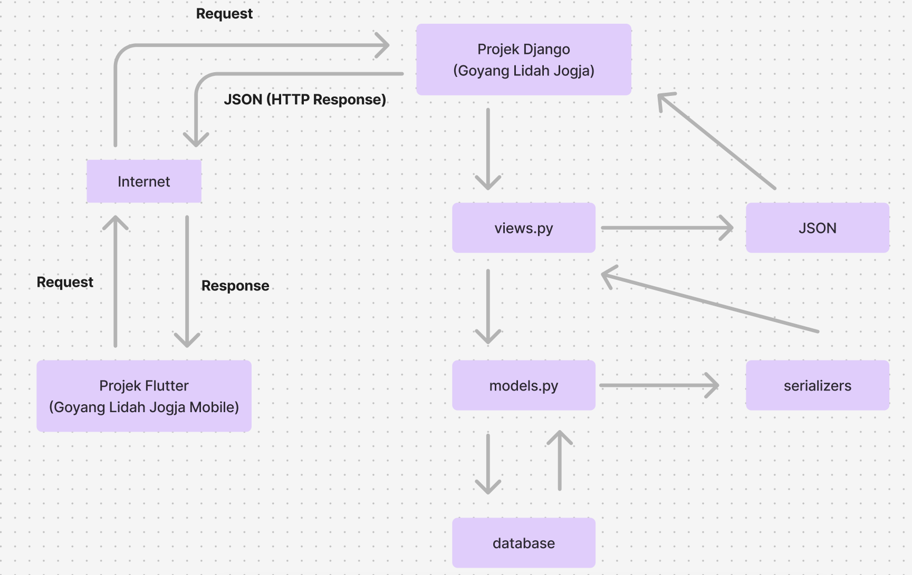

## Anggota Kelompok

- **Alyssa Layla Sasti** - 2306152052
- **Malvin Muhammad Raqin** - 2306275821
- **Farhan Dwi Putra** - 2306245743
- **Vissuta Gunawan Lim** - 2306214656
- **Rakabima Ghaniendra Rusdianto** - 2306228472 

# GoyangLidahJogja

GoyangLidahJogja adalah platform online yang dirancang untuk memudahkan Anda dalam menjelajahi, menemukan, dan menikmati ragam kuliner terbaik yang ada di Yogyakarta. Kami menyediakan informasi lengkap, rekomendasi akurat, dan ulasan jujur dari para pecinta kuliner dan komunitas lokal. Baik Anda seorang wisatawan yang ingin menikmati cita rasa khas Jogja atau penduduk lokal yang mencari referensi tempat makan baru, GoyangLidahJogja siap membantu Anda menemukan sajian kuliner yang memanjakan lidah.

## Visi & Misi  

**Visi** kami adalah menjadi platform kuliner terdepan di Yogyakarta yang menyediakan rekomendasi restoran terpercaya dan berbasis preferensi pengguna, sekaligus membangun komunitas yang aktif berbagi pengalaman kuliner. Kami ingin membantu pengguna menemukan tempat makan yang tepat dengan mudah dan mendukung pemilik restoran dalam memperluas jangkauan bisnis mereka.

**Misi** kami adalah menyediakan platform yang memudahkan pengguna dalam menemukan tempat makan yang sesuai dengan preferensi mereka melalui rekomendasi yang akurat dan terpercaya. Kami berkomitmen untuk mengembangkan komunitas kuliner di Yogyakarta, di mana pengguna dapat berbagi pengalaman dan ulasan secara transparan. Selain itu, kami ingin membantu pemilik restoran memperluas jangkauan mereka dengan memberikan ruang untuk mempromosikan usaha kuliner mereka secara lebih efektif dan efisien.

## Masalah yang Ingin Ditangani

Masalah utama yang ingin diatasi oleh **GoyangLidahJogja** adalah kebingungan dalam menemukan tempat makan yang sesuai dengan selera, harga, dan lokasi di tengah banyaknya pilihan kuliner di Yogyakarta. Baik wisatawan, penduduk lokal, maupun pendatang yang merasa kesulitan menentukan pilihan tempat makan yang sesuai dengan preferensi mereka.

## Siapa yang Akan Terbantu

Target pengguna utama platform ini meliputi:
- **Wisatawan** yang baru pertama kali mengunjungi Yogyakarta dan belum familiar dengan pilihan kuliner di sana.
- **Penduduk lokal** yang ingin mengeksplorasi tempat makan baru.
- **Pemilik restoran** yang ingin mempromosikan tempatnya.

## Cara GoyangLidahJogja Membantu Pengguna

GoyangLidahJogja menawarkan rekomendasi kuliner yang dipersonalisasi berdasarkan preferensi pengguna seperti jenis makanan, harga, dan lokasi. Beberapa fitur yang akan membantu pengguna antara lain:

- **Pencarian berbasis "tags"**: Memungkinkan pengguna menemukan restoran yang sesuai dengan selera mereka.
- **Fitur GoyangNanti**: Pengguna dapat menyimpan daftar restoran yang ingin dikunjungi di kemudian hari.

## Fitur Utama

1. **Informasi Seputar Event Kuliner**  
   Admin dapat mambuat announcement tentang informasi event kuliner yang bisa dilihat oleh customer dan pemilik resto.
##### Dikerjakan oleh: Rakabima Ghaniendra Rusdianto
   
2. **GoyangNanti**  
   Fitur untuk menyimpan daftar restoran yang ingin dikunjungi di masa depan (konsep seperti "wishlist").
##### Dikerjakan oleh: Alyssa Layla Sasti

3. **Ulasan Pengguna**
   Pengguna dapat membaca ulasan jujur dari komunitas terkait pengalaman kuliner mereka.
##### Dikerjakan oleh: Malvin Muhammad Raqin

4. **Filter Pencarian**
   Pengguna dapat memfilter hasil pencarian berdasarkan tags
##### Dikerjakan oleh: Bersama

5. **Kolom Announcement**  
   Restaurant owner dapat memposting pengumuman khusus terkait restoran mereka.
##### Dikerjakan oleh: Farhan Dwi Putra

6. **CRUD Menu**
   Restaurant owner dapat menambah, mengubah, dan menghapus menu pada restoran.
#### Dikerjakan oleh: Vissuta Gunawan Lim

## Role & Permissions (Peran/Aktor Pengguna Aplikasi)

- **Admin**: 
  - Tambah/Hapus Informasi Event
  
- **Customer**: 
  - Mencari restoran
  - Memberikan ulasan restoran
  - Menambah produk ke wishlist
  - Mendapatkan level berdasarkan jumlah ulasan yang diberikan:
    - Bronze: 15x Review
    - Silver: 25x Review
    - Gold: 50x Review
  
- **Restaurant Owner**: 
  - Memberikan announcement terkait restoran
  - Mengedit detail restoran (khusus untuk restoran yang dimiliki)

# Integrasi Django dan Flutter

Aplikasi **GoyangLidahJogja** mengintegrasikan **Django** sebagai backend dan **Flutter** sebagai frontend untuk menyediakan platform kuliner terbaik di Yogyakarta. Berikut adalah penjelasan singkat mengenai integrasinya:

## Cara Kerja Integrasi

1. **Flutter (Frontend)**
   - Flutter mengirim **request** ke backend Django melalui endpoint API.
   - Data yang diterima dari Django dalam format JSON akan diolah dan ditampilkan di aplikasi mobile.

2. **Internet sebagai Perantara**
   - Semua komunikasi antara Flutter dan Django dilakukan melalui protokol HTTP/HTTPS. Internet berfungsi sebagai penghubung antara frontend di aplikasi Flutter dan backend di Django.

3. **Django (Backend)**
   - Django menerima request dari Flutter melalui endpoint yang sudah didefinisikan di `urls.py`.
   - Django memproses request di `views.py`
   - Setelah request valid, Django menggunakan **Model** untuk mengambil data dari database.
   - Data diubah ke format JSON menggunakan **Serializers**.
   - Django mengembalikan **response** ke Flutter dengan mengirimkan data JSON sebagai **HTTP Response**.

## Alur Kerja Sederhana
1. Pengguna melakukan aksi di aplikasi Flutter, seperti mencari restoran.
2. Flutter mengirim request ke endpoint API Django .
3. Django memproses request dan mengambil data dari database.
4. Django mengirim data restoran ke Flutter dalam format JSON.
5. Flutter menampilkan data tersebut di aplikasi.

## Sumber Initial Dataset

- [Google Sheets - Data Restoran](https://docs.google.com/spreadsheets/d/1CiyTyo6Z4WJ6JniwLJ9oCfMEon323hIYjYlfqgFiw_0/edit?usp=sharing)
- [Trip Advisor - Restoran di Yogyakarta](https://www.tripadvisor.co.id/Restaurants-g14782503-Yogyakarta_Yogyakarta_Region_Java.html)

## Tautan Deployment Aplikasi (Django) :

http://vissuta-gunawan-goyanglidahjogja.pbp.cs.ui.ac.id

## PBP D05 Video Promosi Goyang Lidah Jogja

https://drive.google.com/file/d/1m8LzNJ_Pyn3j58mLc2nlwnFEXUKc6Yu2/view?usp=drivesdk

## Link APK
https://install.appcenter.ms/orgs/pbp-d05-goyang-lidah-jogja/apps/goyanglidahjogja/distribution_groups/public/releases/1

